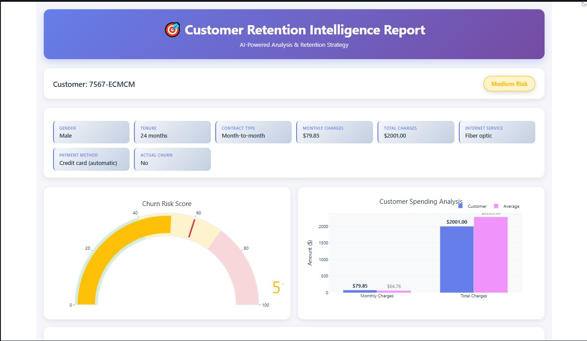
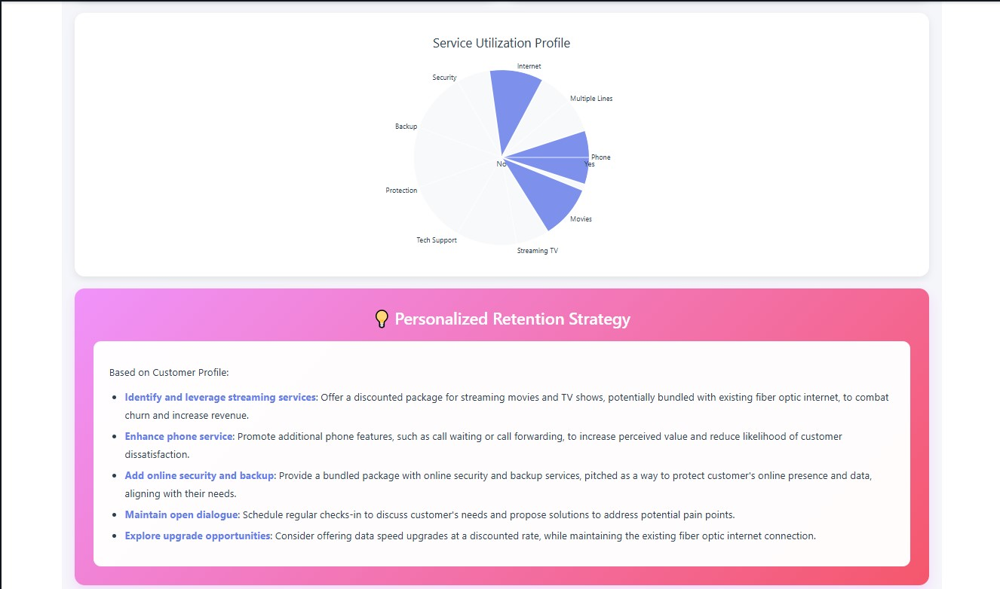

# 🎯 AI-Powered Telco Customer Retention Analysis

[](https://www.python.org/)
[](https://spark.apache.org/)
[](https://databricks.com/)

An end-to-end machine learning solution for predicting customer churn in telecommunications, enhanced with AI-powered personalized retention strategies.

## 🚀 Features

- **Churn Prediction**: Logistic Regression model to identify at-risk customers
- **AI-Powered Insights**: LLM-generated personalized retention strategies using Meta Llama 3.1
- **Interactive Reporting**: Dynamic, responsive HTML reports with Plotly visualizations
- **Real-time Analysis**: Widget-based customer lookup system

## 📊 Project Overview

This project implements a complete customer retention analysis pipeline:

1. **Data Processing**: Load and transform Kaggle's Telco Customer Churn dataset using PySpark
2. **ML Model**: Train a Logistic Regression model to predict churn probability
3. **AI Integration**: Generate personalized retention strategies using Databricks Foundation Models
4. **Interactive Reports**: Create responsive HTML dashboards with visualizations

## 🛠️ Tech Stack

- **Data Processing**: PySpark
- **ML Framework**: Spark MLlib
- **AI**: Databricks Foundation Models (Meta Llama 3.1 8B)
- **Visualization**: Plotly
- **UI**: Custom HTML/CSS with responsive design
- **Platform**: Databricks

## 📂 Project Structure

```
telco-customer-retention/
├── notebooks/
│   └── Telco_GenAI_Project.ipynb    # Main analysis notebook
    
├── screenshots/
│   └── 1.jpg
    └── 2.jpg
                    
```

## 🚦 Getting Started

### Prerequisites

- Databricks workspace
- Access to Databricks Foundation Models
- Kaggle API key (for dataset download)

### Installation

1. **Clone the repository**
```bash
git clone https://github.com/swpr45/telco-customer-retention.git
cd telco-customer-retention
```

2. **Import notebook to Databricks**
- Open your Databricks workspace
- Navigate to **Workspace** > **Users** > your user
- Click **Import**
- Select `notebooks/Telco_GenAI_Project.ipynb`

3. **Attach to compute**
- Attach the notebook to a Databricks cluster
- Recommended: ML Runtime 14.3 LTS or higher

4. **Run the notebook**
- Run all cells in sequence
- First-time setup will download the dataset from Kaggle
- Enter a customer ID in the widget to generate reports

## 📈 Usage

### Quick Start

1. Run cells 1-20 to load data and train the model
2. Run cell 21 to see at-risk customers
3. Copy a customer ID
4. Paste it in the "Customer ID" widget at the top
5. Run cell 24 to generate the interactive report

### Sample Output

The report includes:
- **Churn Risk Score**: Gauge visualization with delta indicator
- **Spending Analysis**: Customer vs. average comparison
- **Service Utilization**: Radar chart of subscribed services
- **AI Strategy**: Personalized retention recommendations

## 🎯 Model Performance

- **Algorithm**: Logistic Regression
- **Features**: tenure, MonthlyCharges, gender, InternetService, Contract
- **Output**: Churn probability (0-100%) and binary prediction

## 🤖 AI Integration

The project uses **Databricks Foundation Models** to generate personalized retention strategies:

- **Model**: Meta Llama 3.1 8B Instruct
- **Prompt Engineering**: Structured customer profile with context
- **Output**: Concise, actionable recommendations (<100 words)

## 📸 Screenshots

### Interactive Report


## 🔮 Future Enhancements

- [ ] Add train/test split and model evaluation metrics
- [ ] Implement additional ML algorithms (Random Forest, XGBoost)
- [ ] Build automated email campaigns for at-risk customers
- [ ] Create A/B testing framework for retention strategies
- [ ] Deploy as scheduled job for weekly analysis

## 📝 License

This project is licensed under the MIT License - see the [LICENSE](LICENSE) file for details.

## 👤 Author

**Swapnil Kuwar**
- GitHub: [@swpr45](https://github.com/swpr45)
- LinkedIn: [Your Profile](https://linkedin.com/in/swpr45)

## 🙏 Acknowledgments

- Dataset: [Telco Customer Churn](https://www.kaggle.com/datasets/blastchar/telco-customer-churn) on Kaggle
- Platform: Databricks
- AI Model: Meta Llama 3.1 8B Instruct

## 📧 Contact

For questions or collaboration opportunities, please open an issue or reach out via LinkedIn.

---

⭐ Star this repo if you find it helpful!
```


